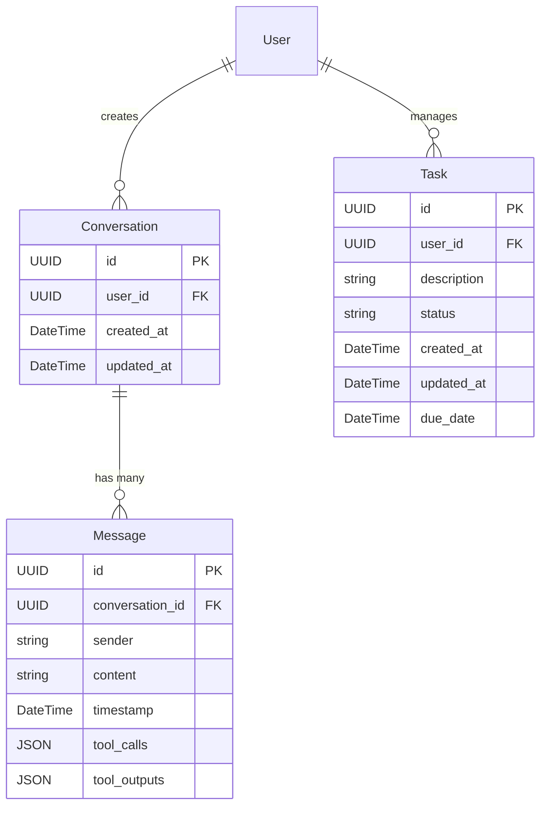

# Data Model: Phase 3 Backend AI Orchestrator

This document defines the data models for the Phase 3 Backend AI Orchestrator service, focusing on conversations, messages, and integration with an existing task management system. The models are designed with SQLModel, which combines the benefits of SQLAlchemy and Pydantic.

## Key Entities

### Conversation

Represents a single chat conversation between a user and the AI agent.

-   **`id`**: `UUID` (Primary Key)
    -   A unique identifier for the conversation.
-   **`user_id`**: `UUID` (Indexed)
    -   The ID of the user associated with this conversation. This will be an external reference, as user management is handled by other services.
-   **`created_at`**: `DateTime` (Indexed, automatically set on creation)
    -   Timestamp indicating when the conversation was initiated.
-   **`updated_at`**: `DateTime` (Indexed, automatically updated on modification)
    -   Timestamp indicating the last time the conversation was updated (e.g., a new message was added).

**Relationships**:
- Has many `Message`s.

### Message

Represents an individual message within a `Conversation`.

-   **`id`**: `UUID` (Primary Key)
    -   A unique identifier for the message.
-   **`conversation_id`**: `UUID` (Foreign Key to `Conversation.id`, Indexed)
    -   The ID of the conversation this message belongs to.
-   **`sender`**: `str` (e.g., "user", "assistant", "system")
    -   Indicates who sent the message.
-   **`content`**: `str`
    -   The actual text content of the message.
-   **`timestamp`**: `DateTime` (Indexed, automatically set on creation)
    -   Timestamp indicating when the message was sent.
-   **`tool_calls`**: `JSON` (Optional)
    -   If the message from the assistant involves tool calls, this field stores the structured data of those calls.
-   **`tool_outputs`**: `JSON` (Optional)
    -   If the message is a tool output, this field stores the structured data of the tool's result.

**Relationships**:
- Belongs to one `Conversation`.

### Task (Existing Model)

The `Task` model is assumed to exist from Phase 2. This service will interact with it, either directly or through a shared repository. For Phase 3, we ensure compatibility and potentially extend its usage.

-   **`id`**: `UUID` (Primary Key)
-   **`user_id`**: `UUID` (Indexed)
-   **`description`**: `str`
-   **`status`**: `str` (e.g., "pending", "in_progress", "completed", "cancelled")
-   **`created_at`**: `DateTime`
-   **`updated_at`**: `DateTime`
-   **`due_date`**: `DateTime` (Optional)

**Considerations for Phase 3**:
- The `Task` model will be accessed by the MCP tools within the Phase 3 service.
- Any updates or creations of `Task` entities via Phase 3 will adhere to the existing schema and business rules.

## Database Schema (Conceptual)

